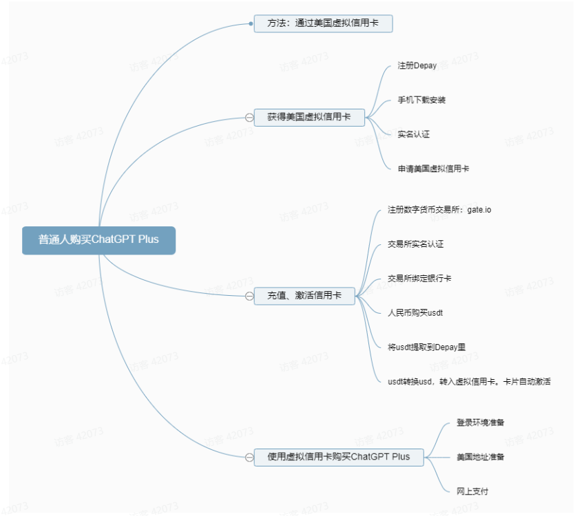

# ChatGPT Plus如何购买（保姆级教程）

ChatGPT Plus版本，运行速度会更流程，个人体验更好，而且购买后，无需魔法即可使用。非常方便。
但是购买它，不能用国内的visa，master信用卡。需要美国的信用卡。我们普通人，很难拥有美国的信用卡。
本文介绍了一种普通人可以操作的方法：利用一款手机应用Depay，用它里面的美国虚拟信用卡，可以购买ChatGPT Plus等需要美国信用卡支付的产品。
很多人会关心：这款App会不会有风险？
个人认为：有风险。买房都有烂尾的风险（比如说某大），全球第二的ftx都破产了，就更别说这个名不见经传的小公司。
但是我们也不能因为风险存在，而什么都不做。
它只是我们 实现目的的一个工具 而已，只要能实现目的，这两天不出问题就好。至于长期风险，因为我们用完就可以丢了，不用管它。
所以，我们 要控制风险：用多少，转存多少。不在这里面留太多USD。

## 1.注册安装

1.1 注册depay打开网站：[https://depay.depay.one/web-app/register-h5？invitCode=449960&lang=zh-cn](https://depay.depay.one/web-app/register-h5%EF%BC%9FinvitCode=449960&lang=zh-cn)

1.2在手机上下载安装（以安卓手机为例）
注册完毕后，下载手机客户端（本教程用的是小米红米）

下载完毕后，通过微信发送到手机

装成功，桌面上会出现Depay图标

1.3手机Depay登录
在手机上打开Depay，然后点击"Log in"

选择用手机号登录

1.4 绑定邮箱
为了使用方法，单击“me"，修改一下软件的语言

绑定邮箱

2.个人身份认证
为了避免坏人做坏事，几乎所有的、和钱相关的App，都需要实名。

点击下一步 进行视频认证

录制后提交就行

等5分钟进行审核

3.激活卡片
3.1 获取虚拟信用卡当身份认证完毕后，就可以开卡了

一般选择万事达的标准卡，比较划算。

开卡时，需要手机验证码。点击获取验证码，填写手机收到的验证码后，点击“确定”即可

出现这个界面，开卡成功了。
（说明：开卡成功后，暂时还不能用。充值后，会自动启用）

4.Depay充值
充值需要用到 波场 TRC-20 USDT.（不懂的需自行百度）
如果您有trc20 usdt，略过这一节，直接看第5节。
如果您没有trc20 usdt，请继续往下看：购买trc20 usdt需要用到数字货币交易所。
个人观点：所有的数字货币交易所都不可靠
所以，我们只把它当做工具，临时用一下。只要在我们使用它的这一两天不跑路就好，以后的事，谁都说不上。
这里推荐的是我个人使用了9年的芝麻开门交易所。

4.1 交易所注册
注册前的准备：
①个人邮箱：yesai66666@qq.com
②手机号：13343438888
③身份证（认证使用）
注册步骤：
打开网站：[https://www.gate.io/ref/124370](https://www.gate.io/ref/124370)

验证成功，登录即可。

第一次登录，需要邮箱验证码

绑定手机。（建议绑定，之后有任何资金变动，都需要手机验证码。即使密码被盗，别人也动不了你的资金）

4.2 交易所实名认证

人脸识别

认证成功

4.3 绑定收款方式
交易前，必须要绑定本人的账号。可以绑定银行卡、支付宝或微信路径：右上角头像→个人中心→收款设置→添加银行卡（或绑定其它方式）

4.4 人民币购买usdt什么是USDT？这是一种数字货币，中文称为泰达币，是数字货币里的美元，和美元等值。是目前使用最广泛的数字-美元货币。

买入100 usdt，约需要694元RMB

买入的时候，可能会进行风险评测。后面有参考答案。
（评测内容，自己还是要仔细看一看）

风险测评参考答案：

点击这里，获得卖方的信息：

注意：任何时候，汇款时，不要写留言。 不要有任何“比特币”、“虚拟币”等信息。

大约2分钟后，usdt到账 （我是上午6.51手机银行付款，6.53芝麻开门收到usdt)

依次点击”钱包“→经典账户→现货账号， 可以看到自己钱包里的usdt

### **4.5 将usdt转入Depay里**

**特别注意：为了账号安全**

1. 第一次购买usdt后，需要等**24小时后**，才能提币
2. 提币需要1小时

### **获取Depay收款地址**

在手机Depay客户端，获取收款地址：

### **转账**

从芝麻开门转账usdt到Depay

首先，在芝麻开门里，打开现货账户： 依次点击”钱包“→经典账户→现货账号，

![image-20230227125142454](.\chatgpt_plus_imags\image-20230227125142454.png">

**再次核对地址，地址错了谁都找不回来**

**再次核对地址，地址错了谁都找不回来**

**再次核对地址，地址错了谁都找不回来**

输入相应的密码、验证码后，点击“确认提现”

提现需要审核1个多小时，期间会往你的手机上，发一条通知短信。

这次充值，我是7:28提交，9:29到账Depay，花了2小时。

## **5. usdt转换成美元**

现在我们Depay里的usdt，是无法消费的。 需要转换成美元（usd）后，才能激活卡片，才能使用。

转换成功后，点击“立即转入”，把美元转入到虚拟信用卡，会自动激活卡片。 然后就可以使用这张虚拟信用卡了。

点击“安全码” ，会要求进行手机验证。 验证完毕后，就可以看到美国虚拟信用卡的所有信息。有了它们，就可以消费了。

## **6.使用**

### **6.1 支付ChatGPT Plus**

**支付前准备：**

**环境准备** ：魔法上网，开全局。用下面的网址，查看自己的魔法位置。

网址： https://www.ipip.net/?origin=EN

**美国地址准备：**

用美国地址生成器，生成一个地址。 最好和魔法上网的IP地址一致。

网址： https://www.meiguodizhi.com/

打开ChatGPT的聊天界面。 点击“Upgrade to Plus”

网址： https://chat.openai.com/chat

点击“Upgrade plan”

输入美国虚拟信用卡的相关信息和美国地址，然后点击“Subscribe（订阅”

出现这个界面，就说明订阅成功了。 可以放松地玩了。

### **6.2 支付宝**

这个虚拟的美国信用卡，可以直接绑定支付宝消费。

第一次消费的时候，会有限制（毕竟是外国的卡）。

按照提示，申请一下，就能解除限制。

这里需要拍一张虚拟卡的照片。 可以把虚拟卡截图，发到电脑里，然后拍电脑屏幕

注意支付宝发过来的消息。

我解除限制的时候，大约过了4小时，让提交更多的资料。

把身份证的正反面，还有虚拟卡的首页截图（最好是英文界面）传上去。

大约过了2个半小时，收到这张虚拟信用卡解封的信息。 然后，扫码时，选择这张虚拟信用卡，就可以了。

我看官方说明是收3%的服务费。但是实际刷卡的时候，服务费是减免的。

### **6.3 其它应用场景**

可以绑定支付宝消费（本人已亲自测试）；可以绑定微信购买京东产品（本人已亲自测试）；还能用美团、Google play、PayPal商户等（官方说明，本人未测试）

附录： **一定要阅读下面的文章** 官方介绍：

Depay Master Visa卡新用户使用指南（官方的）： https://telegra.ph/Master-Visa%E5%8D%A1%E6%96%B0%E7%94%A8%E6%88%B7%E4%BD%BF%E7%94%A8%E6%8C%87%E5%8D%97-09-29