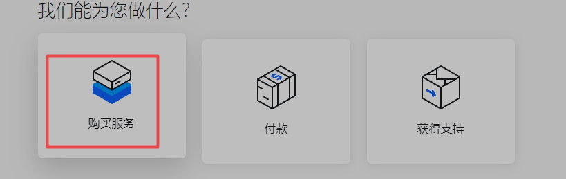

# ChatGPT初次登录以及使用教程

## 一、准备“蹄子”
**1.开蹄子
蹄子、科学上网、V披N，三者是同一个意思。**
第一步，点击这个网址：
[购买快乐！](https://portal.shadowsocks.au/aff.php?aff=64375)

第二步，点击产品服务的购买服务。

我们直接选择最便宜的就行了

## 然后用支付宝付款就行了然后在网站里下载clash

软件使用
下载下来之后先安装，出现如下页面：

获取链接
1、点击产品服务。

导入clash
1、打开自己clash，点击Profiles，复制刚才我们复制的链接，点击Download

2、出现这个表示成功

修改节点
选中Proxies，选择一个节点（美国）

**2.确认IP查ip，打开https://www.ip138.com/，看下图红框内不能是中国、香港、台湾、澳门、额罗斯**

获取链接
1、点击产品服务，点击我的服务。

### 3.尝试登录
**注意，第2 点不是必需的，有些设备 ip 查询会延迟但当下依然能登录 ChatGPT。你可以开始以下尝试。尝试登陆前，先关闭浏览器的自动翻译功能**

## 二、登录
登陆使用详细步骤之ChatGPT：
[https://openai.com/blog/chatgpt/](https://openai.com/blog/chatgpt/)

## **好了，以上就是关于ChatGPT的登陆和使用方法，希望你能顺利登陆。**
登陆使用详细步骤之：GPT-3[AI写论文教程]
[https://openai.com/api/](https://openai.com/api/)

## 登陆使用详细步骤之：DALLE2[AI 绘画教程]
[https://openai.com/dall-e-2/](https://openai.com/dall-e-2/)

### 这里有个进阶玩法，可能一时灵感不够或者词穷，我们可以到chatgpt让ai帮我吗生成一段要描述的场景或事物，然后复制到Dalle2这里，希望对你有所帮助。
以上就是关于Openai三个项目的详细使用教程，希望对您有所帮助，

## 三、登录不上

如果出现这样一个红线，就是验证码没加载出来，刷新或者换浏览器可以解决

**Go back如果像上图显示，不支持你的 country，说明没能连接成功**

### 如果像上图显示，不支持你的 `country`，说明没能连接成功由于每个人的设备和网络环境不同
没人可以通过这张图片就判断问题出在哪里接下来你可以如下尝试、逐一排除，以能登录上为目的：
重开浏览器进行登录
还是不行
浏览器开无痕模式/隐私模式，进行登录还是不行
检查ip，不能是香港、台湾、澳门、额罗斯并且蹄子要开全局模式
怎么开？可以咨询蹄子供应商，或者去搜索引擎：“蹄子的名字+全局模式”
还是不行
就清理缓存，换浏览器
若还是不行
那只能是蹄子没开对，咨询蹄子供应商
问他（如何登录 OpenAI？如何开全局？如何开无痕？）

## 四、常见问题

### 问：如何使用中文版？
答：你问他中文，他就回答你中文。
你甚至，可以命令他以任何的语言回答你的问题

### 问：如何收费的？

现目前，是这样收费，费率相当低，查看网页https://openai.com/api/pricing/

### `问：18美元在哪里？`

查看网页：[https://beta.openai.com/account/usage](https://beta.openai.com/account/usage%E9%97%AE%EF%BC%9A%E5%A6%82%E4%BD%95%E4%BF%AE%E6%94%B9ChatGPT%E7%9A%84%E7%99%BB%E5%BD%95%E5%AF%86%E7%A0%81%EF%BC%9F)

### 问：如何修改ChatGPT的登录密码？

### 答：永久使用账号支持改密，在openai的首页点击忘记密码，然后登录您的邮箱账户蜜码可以接受到openai 给您发的改密码的邮件，点击进去更改。
问：之前正常，今天上不去了
答：无非就是IP不行（蹄子）、浏览器不行、网页不行、设备不行中的某一个问题，你需要通过控制变量的方法逐个排除、多试几次
问：能用多久？
答：目前收费很低，18美元用完了，需要充值。
其实，不充值，再买一个新号内含 18美元，不香吗？

## 五、常见错误

Capacity，就是满了的意思。
服务器满了，短时间内限制新的访问，除了等没其他办法

### 输入框下边是一条横线，这是网速太慢了，验证码没加载出来等、或者点 continue重新发起请求

### 只回答一个“的”字，请关闭浏览器的自动翻译功能

### Access denied/访问拒绝
这是官方服务器被挤爆了，所有人都会或多或少遇到这个情况！
本质原因就是人太多了，服务器满了要限流分流，没有根本的解决办法由于每个人的设备和网络环境不同，客服也无法根据截图就立马判断出您适合哪种解决法建议你可以如下尝试、逐一排除：
1，先清理浏览器cookie，然后刷新重新登录
2.换浏览器（Google Chrome 优先）重新打开登录。重开不行尝试清理 cookie 重新登录
3.把蹄子换成日韩美这几个中延迟最低的节点，然后把蹄子和登录的页面全部都关闭。等个几秒钟，重新打开蹄子，再开启google浏览器无痕模式打开openai登录页面重新登录账号即可~
检查ip，不能是香港、台湾、澳门、额罗斯
梯子要开全局模式
怎么开？可以咨询蹄子供应商，或者去搜索引擎：“蹄子的名字 +全局模式”
换到一个人少的地方，偏僻的IP，通常能够一定程度解决换了IP再清理一次缓存，并且一分钟后再试
以上流程多尝试几次
尝试三次以上还不行，就只能等过流量高峰

### 这是官方服务器被挤爆了，所有人都会或多或少遇到这个情况！
刷新了再问，除此之外没其他解决办法。
官方说，以后可能会推出专业版，专业版不会遇到这个情况！

### 如果您遇到此问题，那是因为您没有全局代理或位置设置不正确。例如，HK，TW，CN 代理，如果弹出这样的窗口，那么再切换代理也没用。
你可以冲洗打开浏览器，直接登https://chat.openai.com/chat，[有时候OpenAl.co](http://xn--openal-op0jp60my9b.co/) m不能登，二级域名却可以

openai服务器崩，晚点再试

在一次对话中，你感觉他还没说完，打“继续”，他会接着说