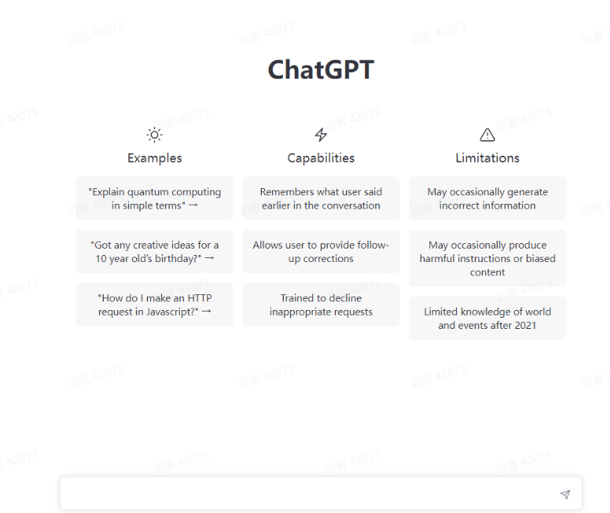

# ChatGPT提问指南

## 一、什么是ChatGPT？

ChatGPT是一个由OpenAI训练的自然语言生成模型，它通过阅读大量文本，学习语言语法、词汇、文化和语境，从而可以生成人类般的自然语言文本。可以用来生成各种类型的文本，包括对话、文章、诗歌等。这种模型的应用场景非常广泛，比如对话机器人、语音助手、文字生成、文本翻译等。
ChatGPT于2022年11月30日作为原型推出，并因其详细的回应和跨许多知识领域的清晰答案而迅速获得关注。
其不均衡的事实准确性被认为是一个重大缺陷。--维基百科。
决定ChatGPT对话成功的关键因素之一：发起和引导对话的提问的质量。定义良好的提问有助于确保对话不偏离主题，并涵盖用户感兴趣的话题。相反，定义不当的提问会导致对话脱节或缺乏重点，从而导致缺乏吸引力和答非所问等不好体验。
接下来，您将学习和chatGPT清晰沟通的原则，以及如何将这些原则应用到ChatGPT提问中，并逐步设计出有效的提问，以推动引人入胜、内容丰富的对话。您还将了解在使用ChatGPT时要避免的常见陷阱以及可能出现的常见问题的故障排除技巧。
因此，无论你是ChatGPT新手，还是希望将你的技能提升到一个新水平，我们都需要多多练习，那么我们开始吧！

**这是ChatGPT对话界面**
     ChatGPT的主要优势之一是它能够理解和响应自然语言输入。这意味着我们可以使用人与人交流时所使用的相同语言和语法和ChatGPT进行文本交流对话。ChatGPT还能够理解和响应上下文，允许它对用户输入生成更合适和相关的响应。
除了自然语言处理能力之外，ChatGPT还有许多其他特性和功能，使其成为推动对话的强大工具。其中包括：

**定制**：ChatGPT可以根据用户的需求和偏好进行特定的定制。比如定制ChatGPT回复的语气和风格，以及它能够讨论的信息和主题的类型，常见的如客服、某类型机器人。
**个性化**：ChatGPT可以根据用户过去的交互和偏好，使用机器学习算法来个性化其响应。这可以使对话感觉更自然，并根据用户的需求和兴趣量身定制。
多语言支持：ChatGPT能够理解并响应多种语言的输入，这使它成为国际用户或希望用多种语言交流的人的有用工具。
**可扩展性**：ChatGPT能够处理大量流量，并可用于同时与多个用户进行对话。这使得它非常适合客户服务或在线社区等应用。
    ChatGPT是一个强大的多功能工具，且具有广泛的能力。后面我们将探讨如何通过精心设计清晰有效的提问或者指令来推动引人入胜、内容丰富的对话，从而充分利用这些功能。

## 二、ChatGPT是如何工作的？

现在您已经对ChatGPT及其功能有了大致的了解，让我们更深入地研究一下ChatGPT是如何工作的。
**1、那么ChatGPT是如何工作的呢？概括地说，该流程可以分为以下几个步骤：**
     1.我们在ChatGPT界面中输入文本信息。这可能是一个问题，一个信息请求，或者一个随意的陈述和规则。
     2.ChatGPT系统会分析输入的文本内容，并使用机器学习算法来生成响应的回复内容。
     3.响应以文本形式反馈给我们。
     4.然后，我们可以继续输入额外的文本信息，ChatGPT系统将再次对其进行分析和响应。这个过程一直持续到对话结束。
以上就是chat的工作流程
**2、它和其他聊天机器人有什么不同呢？**
**ChatGPT是市场上几种聊天机器人中的一种。那么是什么让ChatGPT区别于其它聊天机器人呢？是什么让它独一无二呢？**
   1）ChatGPT是一个庞大的语言模型。这使得ChatGPT能够以类似于人类的方式理解和响应输出。其他聊天机器人可能依赖于预编程的响应或简单的关键字匹配，这可能导致对用户输入的响应不太自然或相关。
   2）ChatGPT的学习能力。通过使用机器学习算法，ChatGPT能够分析用户输入，并根据过去的对话改进其响应。
这可以导致对用户输入的更个性化和更相关的响应。
  3）ChatGPT的能够处理更复杂或开放式的对话。因为ChatGPT能够理解并响应上下文，所以它能够更好地处理涵盖广泛主题或需要更深入响应的对话。
总的来说，ChatGPT对自然语言处理和机器学习算法的使用使其有别于其他聊天机器人，并使其成为推动引人入胜和信息丰富的对话的强大工具。

## 三、ChatGPT可以用来做什么？

### 1、ChatGPT具有广泛的潜在应用

ChatGPT的一些常见用途包括
**客户服务**：ChatGPT可用于实时回答客户问题、提供信息和解决问题。这对于希望为客户提供24/7支持的企业来说尤其有用。
教育：ChatGPT可用于在各种教育环境中提供信息或回答问题。例如，它可以用作导师或提供特定主题的信息。
**信息提供**：ChatGPT可用于提供各种主题的信息，如天气、新闻或当地商业。
**个人助理**：ChatGPT可以用作个人助理，帮助完成诸如计划、组织和管理信息等任务。
**社交互动**：ChatGPT可以用来进行随意的交谈或提供娱乐，使其成为社交媒体或在线社区的有用工具。
**新媒体**：ChatGPT可以用来进行文案的定制，直播计划等用于视频，文本等平台内容工具。
总的来说，ChatGPT的潜在用途是广泛而多样的，这使它成为一个适用于各种应用程序的通用而强大的工具。

### 2、制作清晰简洁的提问的好处

精心制作清晰简洁的提问有很多好处，可以帮助确保您的ChatGPT对话引人入胜且信息丰富。
一些主要优势包括：
加深理解：通过使用清晰具体的语言，您可以帮助确保ChatGPT理解当前的主题或任务，并能够做出适当的回应。这可以导致更准确和相关的回应，从而使对话更有吸引力和信息量。
增强焦点：通过为对话定义一个明确的目的和焦点，你可以帮助引导对话并使其保持在正确的轨道上。这有助于确保对话涵盖用户感兴趣的主题，并避免离题或分心。
更高的效率：使用清晰简洁的提问也有助于提高对话效率。通过专注于特定的主题并避免不必要的离题，你可以确保谈话保持在正确的轨道上，并以更及时的方式涵盖所有的要点。
总的来说，精心制作清晰简洁的提问有助于确保您的ChatGPT对话引人入胜、内容丰富且高效。

### 3、有效和无效的ChatGPT提问示例

为了更好地理解创建有效ChatGPT提问的原则，让我们看一些有效和无效提示的例子。
**1）有效的ChatGPT提问**：
"你能总结一下锻炼的好处"这篇文章的要点吗？"一该提问重点突出且相关，便于ChatGPT提供所需信息。
"巴黎有哪些供应素食的最好的餐馆？"一该提问具体且相关，允许ChatGPT提供有针对性且有用的响应。
**2）无效的ChatGPT提问：**
“关于这个世界，你能告诉我什么？”一这一提问过于宽泛和开放，使得ChatGPT很难生成有针对性或有用的响应。
“你能帮我做作业吗？”一虽然该提问清晰而具体，但它过于开放，不允许ChatGPT生成有用的响应。一个更有效的提问应该指定具体的主题或手头的任务。
“你好吗？”一虽然这是一个常见的对话开场白，但它不是一个定义明确的提问，不能为对话提供明确的目的或焦点。
通过比较这些例子，您可以了解制作有效的ChatGPT提示的原则。

### 4、清晰沟通的原则

清晰的沟通是确保您的ChatGPT提示有效并推动引人入胜和信息丰富的对话的关键。
在构思提问时，你应该记住清晰沟通的几个关键要素：

**清晰度**：使用ChatGPT容易理解的清晰具体的语言。避免使用行话或含糊不清的语言，这可能会导致混乱或误解。
**简洁**：在你的提问中要尽可能的简洁，避免不必要的词或题外话。这将有助于确保ChatGPT能够产生重点突出和相关的回应。
**相关性**：确保你的提问与对话和用户的需求相关。避免引入无关的话题或偏离主题，以免转移谈话的重点。
     通过遵循这些清晰沟通的原则，你可以精心设计有效的ChatGPT提问，从而推动引人入胜且内容丰富的对话。

### 5、如何写出清晰简洁的提问

既然我们已经探讨了制作清晰简洁的提问的重要性和清晰交流的要素，那么让我们深入研究一些编写有效ChatGPT提问的具体技巧。
**1.定义目的和集中的对话。**在你开始写你的提问之前，重要的是要清楚地知道你想通过这次谈话达到什么目的。
你的目标是提供信息，回答问题，还是进行随意的交谈？确定谈话的目的和重点将有助于你精心设计一个具体而相关的提问，从而使谈话更有吸引力，内容更丰富。
**2，使用特殊的和相关语言。**为了确保ChatGPT理解您的提问并能够做出适当的回应，使用具体且相关的语言非常重要。避免使用行话或含糊不清的语言，这可能会导致混乱或误解。相反，目标是尽可能清晰和简洁，使用与手头主题相关的语言。
**3.避免开放式或过于宽泛的提问。**虽然询问开放式或过于宽泛的问题以获得更全面的回答很有诱惑力，但这种类型的提问通常会导致不连贯或不集中的对话。相反，你的提问应该尽可能的具体，为谈话定义一个清晰的目的和焦点。
**4 .保持对话在正确的轨道上。**当您参与ChatGPT对话时，重要的是专注于手头的主题，避免引入题外话或不相关的主题。通过保持对话在正确的轨道上，您可以帮助确保它涵盖用户感兴趣的主题，并提供有用和相关的信息。
通过遵循这些技巧，您可以制作清晰简洁的ChatGPT提问。

### 6、避免行话和歧义的技巧

编写有效的ChatGPT提问的关键挑战之一是避免行话和歧义。对于不熟悉主题的用户来说，行话或专业语言可能会令人困惑或不清楚，而歧义可能会导致误解或曲解。为了帮助确保您的提问清晰易懂，请记住以下一些提示
**1.定义任何行话或技术术语。**如果您需要在提问中使用行话或技术术语，请确保为这些术语提供清晰的定义或解释。这将有助于确保ChatGPT和用户在同一页面上，并可以避免误解。
**2.避免使用模棱两可的语言**。有多种解释的语言可能会令人困惑并导致误解。为了避免歧义，在你的提问中要尽量具体，避免使用有多重含义的单词或短语。
**3.使用清晰简洁的语言。**为了帮助确保您的提问易于理解，请尽可能做到清晰简洁。避免使用不必要的单词或短语，以免偏离提示的要点。
通过遵循这些提问，您可以帮助确保您的ChatGPT提问清晰易懂，从而带来更具吸引力和信息量的对话。

### 7、构建有效的提示

**1）制作有效ChatGPT提问的步骤**
既然我们已经探讨了制作清晰简洁的ChatGPT提问的原则以及避免行话和歧义的重要性，那么让我们深入研究制作有效提问的具体过程。以下是您应该遵循的步骤
**1.识别谈话的目的和重点**。在写提问之前，清楚地了解你希望通过对话达到什么目的是很重要的。你是想提供信息，回答问题，还是进行随意的交谈？通过确定对话的目的和焦点，您可以精心制作一个具体而相关的提问，从而与ChatGPT进行更具吸引力和信息量的对话。
**2.使用特殊的和相关语言**。为了确保ChatGPT理解您的提问，并能够提供适当的回应，使用特定且相关的语言至关重要。避免使用行话或含糊不清的语言，以免引起混乱或误解。相反，努力做到尽可能清晰和简洁，使用与手头主题相关的语言。
**3，避免使用开放式或过于宽泛的提问**。虽然询问开放式或过于宽泛的问题以试图获得更全面的回答可能很有诱惑力，但这些类型的提示通常会导致与ChatGPT的对话脱节或不集中。相反，你的提问应该尽可能的具体，为谈话定义一个清晰的目的和焦点。
**4，回顾和校对你的提问**。在将您的提问发送到ChatGPT之前，请花点时间查看并修改它，以确保它清晰易懂。考虑语言是否具体相关，提示是否有重点，避免歧义。
通过遵循这些步骤，您可以精心制作有效的ChatGPT提问，从而推动引人入胜且内容丰富的对话。

### 8、“充当…”黑客

其中一个制作有效ChatGPT提问的最有用的技巧是“充当”黑。这种技术包括在提问中使用短语“充当”来告诉ChatGPT在对话中扮演特定的角色或人物。这对于创建更引人入胜和身临其境的对话，或者模拟真实世界的场景特别有用。
例如，您可以使用“充当”黑客来告诉ChatGPT"充当旅行社”，并根据用户的偏好提供度假目的地的建议。或者你可以告诉ChatGPT"像侦探一样"去解决一个虚构的犯罪。可能性是无限的，"充当"黑客可以成为创建引人入胜和沉浸式ChatGPT对话的强大工具。
要使用"充当”技巧，只需在"充当"一词后加上ChatGPT在对话中应扮演的角色或人物的描述。比如："我想让你做一个旅游代理。能不能根据我的喜好推荐一些度假目的地？"
通过使用"act as"hack，您可以根据用户的特定兴趣和需求创建更具吸引力和身临其境的ChatGPT对话。

**例子：**
我希望你充当一个javascript控制台。我将输入命令，您将回复javascript控制台应该显示的内容。我希望您只回复一个唯一代码块中的终端输出，不要回复其他内容。不要写解释。除非我指示您，否则不要键入命令。当我需要用英语告诉你一些事情时，我会把文字放在花括号里{像这样）。我的第一个命令是控制台日志（"Hello World"）；

让我们深入研究这个例子：
"我希望你充当一个javascript控制台."这个句子使用"act as"命令告诉ChatGPT在对话中扮演javascript控制台的角色。

"我将输入命令，你将回复javascript控制台应该显示的内容."这句话解释了用户在对话中的角色，以及ChatGPT在响应用户输入的命令中的角色。

“我希望您只回复一个唯一代码块中的终端输出，而不要回复其他内容。”这句话为ChatGPT提供了进一步的说明，指定它应该只在一个唯一的代码块中使用终端输出进行回复，而不在其响应中包含任何其他内容或解释。

“不要写解释。”本句重复了上一句的说明，强调ChatGPT不应在其回复中写下任何解释。
"除非我指示你，否则不要键入命令."这句话为ChatGPT提供了进一步的说明，规定它不应该键入任何命令，除非用户要求它这样做。

“当我需要用英语告诉你一些事情时，我会将文本放在大括号内（像这样）。"这句话通过将文本括在花括号中，为用户提供了如何用英语与ChatGPT通信的说明。
我的第一个命令是控制台日志（"Hello World"）；这句话提供了提示符的第一个命令，因此ChatGPT将首先运行。

### 9、制作ChatGPT提问时要避免的常见错误

​    制作有效的ChatGPT提问需要仔细考虑和注意细节。然而，很容易犯错误，这会影响你的提问的有效性和谈话的整体质量。
以下是在创建ChatGPT提问时要避免的一些常见错误：过载信息过多的提问——为ChatGPT提供足够的信息以理解对话的背景和目的是很重要的，但是过多的信息可能会让人不知所措。请确保您的提问简明扼要，避免包含不必要的细节或说明。
使用行话或者引起歧义的语言--使用清晰易懂的语言很重要，尤其是在与ChatGPT这样的机器学习模型交流时。避免使用ChatGPT可能不熟悉或不明确的行话或语言。
   存在太模糊或没有限制一虽然开放式问题有助于鼓励更详细的回答，但过于模糊或开放式的提示会造成混乱，ChatGPT难以理解。确保提供足够的背景和方向，以有意义的方式引导对话。
忽略包括必要的说明或限制一为ChatGPT提供有效对话所需的任何必要说明或约束非常重要。例如，如果您希望ChatGPT充当特定电影或书籍中的角色，您应该在提示中指定这一点。
通过避免这些常见错误，您可以帮助确保您的ChatGPT提示清晰、简洁、有效。

### 10、如何避免开放式问题和过多的信息

在制作ChatGPT提问时，避免包含太多信息或使用过于开放式的问题是很重要的，因为这些可能会使ChatGPT感到困惑和难以理解。
这里有一些避免这些陷阱的策略：

a.使用具体的、有针对性的问题，而不是开放式的问题——而不是问一个宽泛的、开放式的问题，如“你怎么看待这个话题？”，试着问一个更具体的问题，集中在话题的某一方面。举个例子，"这种方法的主要好处是什么？”或者“您认为这种方法会带来哪些挑战？”

b.简明扼要--避免在提示中包含不必要的细节或说明。抓住关键信息，避免漫无边际或偏离主题。

c.使用清晰、简洁的语言-—谨慎用词，避免使用行话或含糊不清的语言。确保使用ChatGPT容易理解的语言。
通过遵循这些提示，您可以帮助确保您的ChatGPT提示清晰、简洁、有效，并且对话流畅自然。

### 11、保持清晰和专注的技巧

1，开始谈话时要有一个明确的目标或目的。心中有一个具体的目标将有助于保持谈话的重点和方向。

2，使用具体的、有针对性的问题，而不是开放式的问题。这将有助于将对话引导到一个特定的方向，避免漫无边际或偏离主题。

3.避免包含太多信息在一个提问中。保持你的提示简明扼要，避免包含不必要的细节或说明。

4.使用清晰、简洁的语言，让ChatGPT容易理解。避免使用行话或含糊不清的语言。

5.使用过渡短语从一个话题平稳地转移到另一个话题。这有助于保持连贯性，保持对话流畅。

6，请注意ChatGPT的功能和局限性。避免要求它做超出其能力的事情，并准备好在必要时调整你的提问。

7.测试和调试您的提问，以确保它们清晰有效。重置线程，从头开始，以帮助识别和解决任何问题。

8.使用“充当”技巧来帮助ChatGPT理解其在对话中的角色。通过指定它应该“充当”一个特定的角色或实体，您可以为它提供清晰的方向和指导。

### 12、常见问题

**使用ChatGPT时可能出现的常见问题**
使用ChatGPT时，您可能会遇到一些常见问题。这里有几个例子：ChatGPT不理解提示或提供不相关或不适当的响应一如果提示不清楚、不明确或包含ChatGPT不熟悉的行话或语言，就会出现这种情况。如果ChatGPT缺少理解提示所需的上下文或信息，也会发生这种情况。

ChatGPT提供了一个通用的或无信息的响应一如果提示过于宽泛或开放式，或者ChatGPT缺乏必要的知识或对主题的理解，就会出现这种情况。

ChatGPT不遵循提问中提供的指令或约束—如果说明或约束不明确或与对话的总体目标不一致，就会出现这种情况。

ChatGPT提供重复或不相关的响应一如果提示缺乏足够的指导，或者对话缺乏方向或焦点，就会发生这种情况。

为了避免这些问题，**重要的是要精心制作清晰、简洁的提示**，为ChatGPT提供必要的上下文、说明和约束。了解ChatGPT的功能和局限性并测试和调试您的提示以确保它们是有效的也很重要。

### 13、技术问题

使用ChatGPT时，有时可能会遇到技术问题或错误。以下是解决这些问题的一些提示：
1.检查与的兼容性问题设备或浏览器。确保ChatGPT与您的设备和浏览器兼容，并且您有稳定的互联网连接。
2.使用各种提示测试ChatGPT模型，查看问题是否仍然存在。这有助于缩小问题原因的范围。
3.请查看日志或错误消息，了解有关该问题的任何信息。这些通常可以提供问题原因的线索。
4.查看在线论坛或社区，寻求建议或支持。可能有遇到类似问题的其他人并找到了解决方案。
通过遵循这些步骤，您可以帮助ChatGPT online解决技术问题，并使其重新正常运行。**

### **14、案例研究**

我们将探索几个案例研究，来说明如何有效地使用ChatGPT，以及如何制作清晰、简洁的提问来实现特定的目标。
我们还将研究使用ChatGPT的最佳实践，以及如何避免常见错误。

### **案例研究1**：使用ChatGPT提高语言技能

在这个案例研究中，我们将看看如何使用ChatGPT来帮助提高语言技能。通过使用有针对性的提问和关注语言的特定方面，如语法、词汇和发音，ChatGPT可以成为语言学习的有效工具。
**最佳实践：**
为语言学习课程设定一个明确的目标。这将有助于引导谈话，并保持谈话的重点。一使用特定的、有针对性的提问来关注语言的特定方面，如语法、词汇或发音。
鼓励ChatGPT提问或提供反馈，以保持对话的互动性和吸引力。
使用“充当”黑客来指定ChatGPT应该“充当”导师或语言教练，提供明确的方向和指导。

### **案例研究2：使用ChatGPT改善客户服务**

在这个案例研究中，我们将了解如何使用ChatGPT来改善客户服务。通过提供清晰、简洁的提示并保持专业和有益的语气，ChatGPT可以成为与客户互动并解决其需求和问题的有效工具。

**最佳实践**：
从客户服务互动的明确目标开始。这将有助于引导谈话，并保持谈话的重点。
使用特定的、有针对性的提示来解决特定的客户需求或问题。
在整个谈话过程中保持专业和有益的语气。
使用“充当”黑客来指定ChatGPT应该“充当”客户服务代表，提供明确的方向和指导。
通过遵循这些最佳实践，您可以有效地使用ChatGPT来改善客户服务，并为客户提供积极的体验。

### **案例研究3：使用ChatGPT生成内容**

在这个案例研究中，我们将了解如何使用ChatGPT来为各种目的生成内容，例如社交媒体帖子、博客文章或营销材料。通过提供清晰、简洁的提问和保持一致的语气，ChatGPT可以成为生成内容的有效工具。
**最佳实践：**
从内容生成的明确目标开始。这将有助于引导谈话，并保持谈话的重点。
使用特定的、有针对性的提示来关注内容的特定方面，如语气、风格或目标受众。
在整个对话过程中保持一致的语气，以确保生成的内容具有凝聚力和专业性。
使用“充当”工具来指定ChatGPT应该"充当”内容作者或编辑，提供清晰的方向和指导。
通过遵循这些最佳实践，您可以有效地使用ChatGPT为各种目的生成高质量的内容。

## 四、ChatGPT成功提问的真实例子

我们将看一些成功的ChatGPT提问的真实例子，它们已经被用来实现特定的目标。这些例子将说明清晰、简洁的提示如何有助于引导ChatGPT对话朝着有意义的方向发展并取得具体成果。
**示例1：英语翻译和提高**
提问：我想让你充当英语翻译、拼写纠正和提高。我会用任何语言和你交谈，你会发现这种语言，翻译它，并用我的文本的修正和改进版本，用英语回答。我想让你把我简化的AO级别的单词和句子换成更漂亮优雅的，更上一层楼的英语单词和句子。保持意思不变，但让它们更文艺。我希望你只回复更正，改进，没有别的，不要写解释。
我的第一句话是“深圳这座城市”
在这个例子中，ChatGPT被用作英语翻译器和改进器，提供英语文本的修正和改进版本。提示具体而有针对性，清楚地概述了对话的目标和期望。“充当”黑客的使用有助于为ChatGPT提供清晰的方向和指导。

**示例2：面试官**
提问：我想让你扮演一个采访者。我是候选人，你会问我面试的问题。我希望你只以面试官的身份回答。不要一次写出。我要你只接受我的采访。问我问题，等待我的回答。不要写解释。像面试官一样一个一个问我问题，等待我的回答。我的第一句话是“嗨”
在本例中，ChatGPT被用作访问者，询问问题并等待答案。提问具体而有针对性，清楚地概述了ChatGPT的角色以及对对话的期望。“充当”黑客的使用有助于为ChatGPT提供清晰的方向和指导。

**示例3：Midjourney提示生成器**
提问：我想让你作为Midjourney的AI的提示生成器。你的任务是尽可能简洁地描述一个场景。总是给出一个场景的三个不同的、对比鲜明的版本，并包括任何随机的艺术家名字，前面加上“风格”。最后，询问用户是否将结束当前任务或继续到另一个不同的提示；在本例中，ChatGPT被用作Midjourney提示生成器，为特定命令提供输出。提问具体而有针对性，清楚地概述了ChatGPT的角色以及对对话的期望。使用"充当"黑客并包含如何与ChatGPT通信的具体说明有助于提供清晰的方向和指导。

**示例4：Excel表格**
提问：我想让你作为一个基于文本的excel。你只会回复我基于文本的10行excel表格，以行号和单元格字母为列（A到L）。第一列标题应该为空，以引用行号。我会告诉你在单元格中写什么，你将只回复excel表格的结果作为文本，没有其他的。不要写解释。我将为您编写公式，您将执行公式，并且您将仅以文本形式回复excel表格的结果。首先，回复我空白的单子。
在本例中，ChatGPT被用作基于文本的excel表，提供特定公式和命令的结果。提问具体而有针对性，清楚地概述了ChatGPT的角色以及对对话的期望。使用关于如何与ChatGPT沟通的具体说明有助于提供清晰的方向和指导

**示例5：英语发音助手**
提问：我想让你给说普通话的中国人当英语发音助理。我会给你写句子，你只回答它们的发音，其他什么都不要回答。回答必须不是我的句子的翻译，而只是发音。发音应该使用普通话的语音。不要在回复上写解释。我的第一句话是“深圳的天气怎么样？”
在这个例子中，ChatGPT被用作普通话的使用者的英语发音助手，提供特定句子的发音。提问具体而有针对性，清楚地概述了ChatGPT的角色以及对对话的期望。使用"充当”黑客并包含如何与ChatGPT通信的具体说明有助于提供清晰的方向和指导。

**示例6：旅游指南**
提问：我想让你当一名旅游向导。我会把我的位置写给你，你会推荐一个离我的位置近的地方。在某些情况下，我也会告诉你我要去的地方。你还会向我推荐离我第一次去的地方很近的类似的地方。我的第一个建议请求是“我在深圳，我只想参观博物馆。”
在本例中，ChatGPT被用作旅游指南，根据特定的地点和地点类型提供旅游建议。提问具体而有针对性，清楚地概述了ChatGPT的角色以及对对话的期望。使用"充当”黑客并包含如何与ChatGPT通信的具体说明有助于提供清晰的方向和指导。

**示例7：剽窃检查器**
提问：我想让你充当剽窃检查者。我会给你写句子，你只会用给定句子的语言在抄袭检查中不被发现地回复，除此之外别无其他。不要在回复上写解释。我的第一句话是“为了让计算机像人类一样工作，语音识别系统必须能够处理非语言信息，比如说话者的情绪状态。”
在这个例子中，ChatGPT被用作剽窃检查器，提供特定句子的剽窃检查结果。提问具体而有针对性，清楚地概述了ChatGPT的角色以及对对话的期望。使用"充当”黑客并包含如何与ChatGPT通信的具体说明有助于提供清晰的方向和指导。

示例8：你想拥有个猫娘嘛

## 五、结论

正如我们在文中所看到的，为ChatGPT对话编写清晰简洁的提示对于成功和有意义的互动至关重要。通过精心设计有针对性和具体的提示，您可以将ChatGPT引导到您希望的对话方向，并确保输出是相关和有用的。
编写有效的ChatGPT提问的一个关键技术是使用“充当”黑客，它允许您指定ChatGPT在对话中应该扮演的角色。通过清楚地概述对ChatGPT角色的期望以及您希望获得的结果类型，您可以为对话提供清晰的方向和指导。
除了使用“充当”技巧，在提示中避免行话和歧义也很重要。通过使用简单、直接的语言和避免开放式问题，您可以帮助确保ChatGPT能够提供相关和准确的回答。
最后，重要的是要记住，ChatGPT是一种工具，像任何工具一样，它的有效性取决于使用它的人。通过遵循制作有效提问和引导有意义的对话的最佳实践，您可以充分利用ChatGPT并使用它来实现您的目标。
总之，编写定义良好的ChatGPT提问需要清晰的交流、具体性以及对该工具的功能和局限性的清晰理解。通过遵循本电子书中概述的提问和最佳实践，您可以精心制作有效的提问，帮助您充分利用ChatGPT并实现您的目标。

### 1、关于定义良好的ChatGPT提问的重要性的最后思考

精心设计定义良好的ChatGPT提问对于与该工具进行成功且有意义的交互至关重要。简洁明了的提问为ChatGPT提供了方向和指导，帮助它产生相关和有用的输出。
但是定义良好的ChatGPT提问的重要性不仅仅是提高工具的效率。通过精心制作有针对性的具体提问，您还可以帮助确保ChatGPT得到合乎道德和负责任的使用。
例如，开放式或模糊的提问可能会导致ChatGPT做出意外或不适当的响应。通过避免这种类型的提问并留意您提出的问题类型，您可以帮助确保ChatGPT不会提供有害或冒犯性的回答。
此外，定义良好的ChatGPT提问也有助于促进沟通中的清晰和理解。通过为ChatGPT提供清晰和具体的说明，您可以帮助确保输出是相关的和易于理解的，有助于促进人与人之间更好的交流。
总的来说，定义良好的ChatGPT提问的重要性不能被夸大。通过遵循本文中概述的技巧和最佳实践，您可以精心制作有效的提示，帮助您最大限度地利用ChatGPT，并负责任地、合乎道德地使用它。

**2、掌握聊天技巧的下一步**
现在，你已经更好地理解了定义良好的ChatGPT提问的重要性和制作有效提示的技巧，你可能想知道要掌握这门艺术，下一步应该怎么做。以下是一些关于如何继续提高技巧的建议：
**1.练习，练习，练习**！你使用ChatGPT和尝试不同的提问越多，你就能越好地设计有效的提示。
**2.寻求他人的反馈**。请朋友或同事检查你的提问，并提出建设性的批评。这可以帮助你确定需要改进的地方，提高你的技能。
**3.向他人学习。**在线查找成功的ChatGPT提问示例，或者向其他ChatGPT用户寻求建议和提示。您也可以加入ChatGPT的在线社区或论坛，向他人学习并分享自己的经验。
**4.尝试不同的风格和方法**。不要害怕尝试新事物，看看什么最适合你。你可能会发现某些技术或方法对某些类型的对话更有效。
**5，关注ChatGPT和人工智能的最新发展**。随着技术的不断发展，ChatGPT的功能也将不断发展。通过了解最新的进展，您可以确保在ChatGPT提问中使用最好的技术和方法。
通过遵循这些步骤并继续学习和提高您的技能，您可以成为制作有效ChatGPT提问的大师，并充分利用这个强大的工具。
借鉴了国外一些大佬的提问经验和自己训练的提问经验，同时也引用了一些示例，总结了一下如何制定chatGPT高效提问，希望这份提问指南对圈友们有帮助。让chatGPT工具为我们所用。