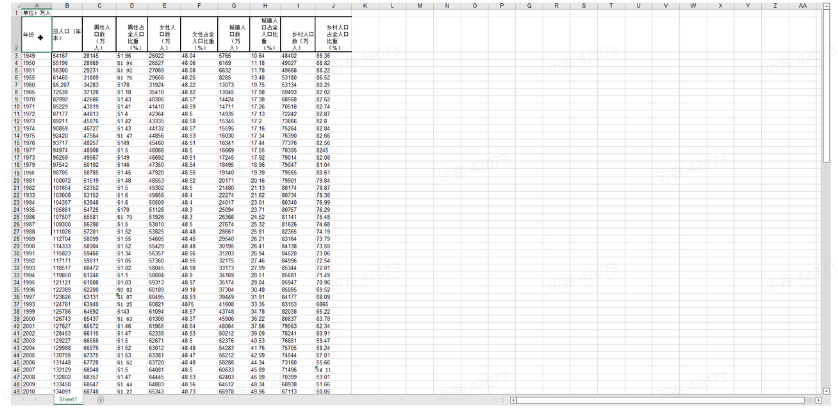

# ChatGPT帮你做PPT

## 运用两个AI工具，完成从数据到PPT制作

使用ChatGPT进行Excel数据表分析并生成PPT报告具体步骤：
（1）准备数据：清洗数据，准备好需要分析的数据表。
（2）询问分析问题：询问 ChatGPT 关于数据表的分析问题，如“请对下列数据表中的数据进行分析？”
（3）获取分析结果：ChatGPT 会根据您的问题提供分析结果，如“你能从XX角度对数据进行一些分析吗？”
（4）制作汇报PPT：使用ChatGPT的分析结果，并利用自动制作PPT的AI软件Tome制作汇报PPT对ChatGPT采用英文提问，得到回复的速度和结果比中文更为准确，所以在操作过程中主要以英文提问为主，为了方便大家的阅读，结果中主要展示中文。

## （1）准备数据：准备好需要分析的数据表

准备好需要进行分析的数据表，对数据原表进行数据清洗，根据自己的需要保留必要数据，清洗数据的这步，单独使用ChatGPT无法做到。数据清洗后，将数据保留到Excel中，准备进行分析使用；

## （2）数据分析：使用ChatGPT进行数据表内数据分析

将清洗后需要分析的数据表复制粘贴到ChatGPT中，进行分析，以统计局统计年鉴1949年至2021年的人口普查数据表为例，对ChatGPT进行提问，请ChatGPT给出数据分析结果。可以先让ChatGPT从它的角度给出数据表的分析角度，通ChatGPT给出的反馈从各个角度去分析。
下面以使用ChatGPT分析人口数据的实际操作过程和具体步骤：

### （2.1）Q：你能分析一下数据表吗？

A：当然！你能提供你希望我分析的数据表吗？如果您还可以指定您希望我执行哪种类型的分析，那将很有帮助。

### （2.2）粘贴数据表格到ChatGPT中

A：本数据表提供了1949年至2021年中国人口的信息。数据包括总人口、男女人口、城乡人口以及各组别占总人口的比例。
从数据中我们可以看出，中国的总人口逐年在稳步增长。1949年总人口5416.7万人，2021年增加到14126万人。
男性人口一直多于女性，男女人口比例保持相对稳定，除 2000年代初男性人口比例略有增加。
在过去的几十年里，城市化一直是中国的一个重要趋势。数据显示，城镇人口占总人口的比重从1949年的10.64%
上升到2021年的64.72%。相反，同期农村人口从89.36%下降到35.28%。
综上所述，数据显示了多年来中国人口和城市化的增长趋势。男女人口比重保持相对稳定，城乡人口比重明显向城镇化转变。
数据分析验证正确，但是这是只涉及对比逻辑的结果展示，不涉及具体的加、减、乘、除运算，整理汇总的很好。

## （3）获取分析结果：ChatGPT 会根据你的问题提供分析结果

### （3.1）A：你能找到一些洞见吗？

​     Q：当然，这里有一些基于数据的见解：
人口增长：多年来，中国总人口持续增长，从1949年的5416.7万人增加到2021年的14126万人男女人口：男性人口一直多于女性人口，男女人口比例保持相对稳定。
  城市化：城市化是中国过去几十年的显着趋势，城市人口从1949年的10.64%增加到2021年的64.72%，同期农村人口从 89.36%下降到 35.28%。
性别失衡：虽然男女人口比例保持相对稳定，但性别失衡仍然很明显，男性占人口的比例较高。
农村到城市的迁移：数据显示，人们正在从农村地区迁移到城市地区，导致农村人口减少，城市人口增加。
这些见解提供了过去几十年中国人口趋势的总体概览，可用于为未来的人口和城市化政策提供信息。
数据分析验证正确，但是这是只涉及对比逻辑的结果展示，不涉及具体的加、减、乘、除运算，整理汇总的很好。

### （3.2）Q：您能否根据这些见解对未来的人口和城市化政策提出一些建议？

A：当然，基于这些见解，这里有一些关于未来人口和城市化政策的建议：鼓励平衡的性别比例：鉴于人口中严重的性别失衡，可以实施政策以鼓励更平衡的性别比例，例如促进性别平等和赋予女性劳动力和教育权力。
推进可持续城镇化：随着城镇化趋势的持续，推进经济发展与环境保护、社会公平和生活质量相平衡的可持续城镇化十分重要。这可能包括促进紧凑高效的城市发展、减少城市扩张以及改善公共交通和负担得起的住房选择的政策。
解决农村地区的需求：随着农村人口的减少，解决农村地区的需求非常重要，以确保他们在经济发展、社会服务和基础设施方面不落后。这可能包括支持农村生计、促进城乡联系以及提供医疗、教育和交通等基本服务的政策。鼓励计划生育：随着人口持续增长，鼓励计划生育以确保可持续的人口增长非常重要。这可能包括提供获得生殖健康服务和教育的机会，以及促进小家庭文化。
这些建议旨在为中国未来的人口和城镇化政策提供一个起点。当然，实施的具体政策将取决于每个地区的独特情况和挑战，需要与利益相关者进行仔细考虑和协商。

### （3.3）Q：你能以段落的形式总结你之前的回答吗？

A：该数据表提供了1949年至2021年中国人口的信息。多年来，总人口稳步增长，男性人口持续多于女性人口，男女人口比例保持相对稳定。城市化是中国的一个显着趋势，城市人口从1949年的10.64%增加到2021年的64.72%，而同期农村人口从89.36%下降到35.28%。基于这些见解，对未来人口和城市化政策的一些建议包括促进更平衡的性别比例、可持续城市化、解决农村地区的需求以及鼓励计划生育。这些政策将取决于每个地区的独特情况和挑战，需要与利益相关者进行仔细考虑和协商。数据分析不涉及具体运算，ChatGPT的逻辑执行很不错。

### （3.4）Q：我想做PPT报告，能不能把之前的回答整理成适合做PPT报告的内容？

A：当然！以下是整理成适合 PPT 报告格式的内容：
幻灯片 1：简介
数据表及其用途的简要概述
幻灯片 2：人口趋势
多年来总人口稳步增长
男性人口一直多于女性人口男女人口比例保持相对稳定
幻灯片 3：城市化中国城镇化的显著趋势
城市人口从 1949 年的 10.64%增加到 2021 年的 64.72%
同期农村人口从 89.36%下降到 35.28%
幻灯片 4：性别失衡
虽然男女人口比例保持相对稳定，但人口性别失衡仍显着
幻灯片 5：农村向城市的迁移
人们正在从农村向城市地区迁移，导致农村人口减少而城市人口增加幻灯片 6：未来人口和城镇化政策建议
鼓励平衡的性别比例
促进可持续城镇化
解决农村地区的需求
鼓励计划生育
幻灯片 7：结论主要发现和建议摘要
这种格式提供了一个清晰和有组织的结构来展示中国人口趋势和城市化的数据和见解，以及对未来人口和城市化政策的建议。

### （3.5）Q：制作PPT需要背景图

请根据你前面的PPT汇报内容，为前面的汇报PPT选取5张合适的背景图，使用Markdown，并且不要有反斜线，不要用代码块，调用Unsplash API（[https://source.unsplash.com/1280x720/?< PUT YOUR QUERY HERE >）

A：这里有五张适合PPT报告的背景图片：

https://source.unsplash.com/1280x720/?population

https://source.unsplash.com/1280x720/%EF%BC%9Fpopulation

https://source.unsplash.com/1280x720/?urbanization

https://source.unsplash.com/1280x720/%EF%BC%9Furbanization

 https://source.unsplash.com/1280x720
（从结果上看，ChatGPT返回的图片并不能很好地匹配幻灯片内容，这里猜测与ChatGPT的"记忆"有关，在字数超出ChatGPT的限制后，就像人的断片一样，出现不能对上下文内容进行很好逻辑判断的问题。）

## （4）使用Tome.AI根据ChatGPT生成的文本结果，自动化生成PPT

（4.1）打开Tome.Al的网址https://tome.app/进行注册

（4.2）在登录进入后的tome网址，进行PPT制作，里面有7个现成的模板，可以使用现有模板进行创作，也可以点击右上角的Create，根据自己的想法进行全新PPT创作；

（4.3）新建PPT后，进行粘贴ChatGPT输出的文本到文本输出框，稍作等待后，Tome.ai会根据文本生成对应的PPT；

（4.4）生成后的PPT可以在网络上以链接的形式进行分享，根据人口调查数据制作的PPT，点击这个链接可以直接查看：[https://tome.app/cc-c9d/template-sales-pitch-cledy3hhs073u99s8bo2cylot](https://tome.app/cc-c9d/template-sales-pitch-cledy3hhs073u99s8bo2cylot)

## 总结

（1）ChatGPT在直接的数学运算上会存在问题，但是在数据的逻辑表达和整理汇总上，能力很强大，特别是在内容的汇总整理上，给出的角度很全面，自己只需要做些润色和补充；

（2）Tome根据文本内容生成PPT的功能很强大，做出的幻灯片效果确实不错，但在PPT中有数据表格需要展示时，软件根据文本直接生成的图表很差，图片不清晰，数据对不上。长期探索Tome发现，Tome非常适合用来做产品营销展示，或讲故事的PPT展示；

（3）ChatGPT + Tome，从数据到文本，生成的速度很快，通常需要熟练办公员工几小时才能实现的效果，现在一个新手在掌握了这个工作流程后，可以很快输出不错的结果，效率提升UP，UP，UP！