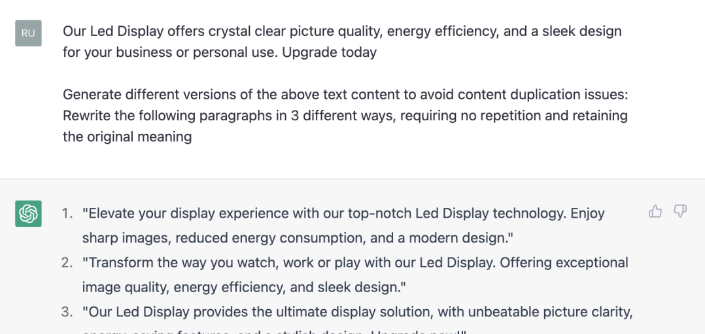
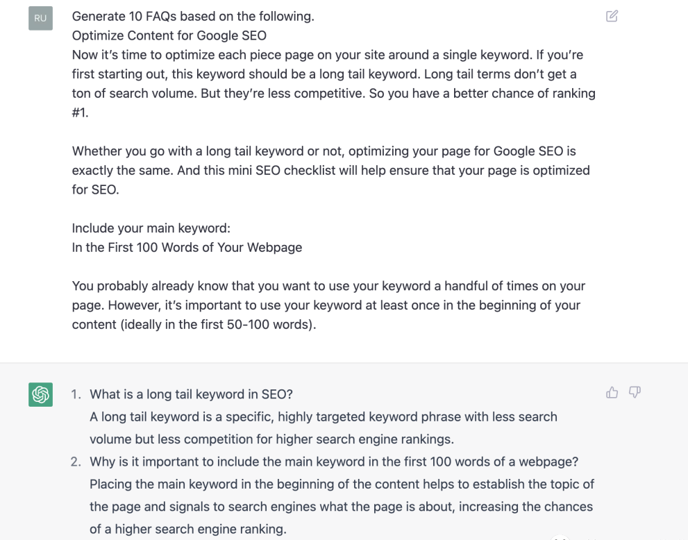
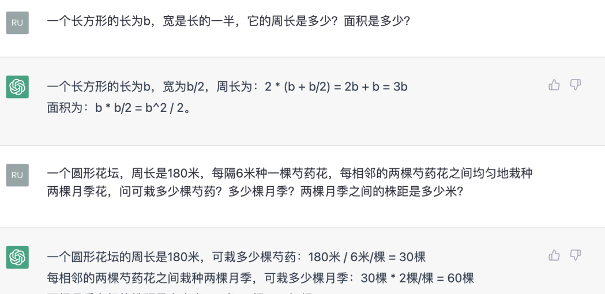
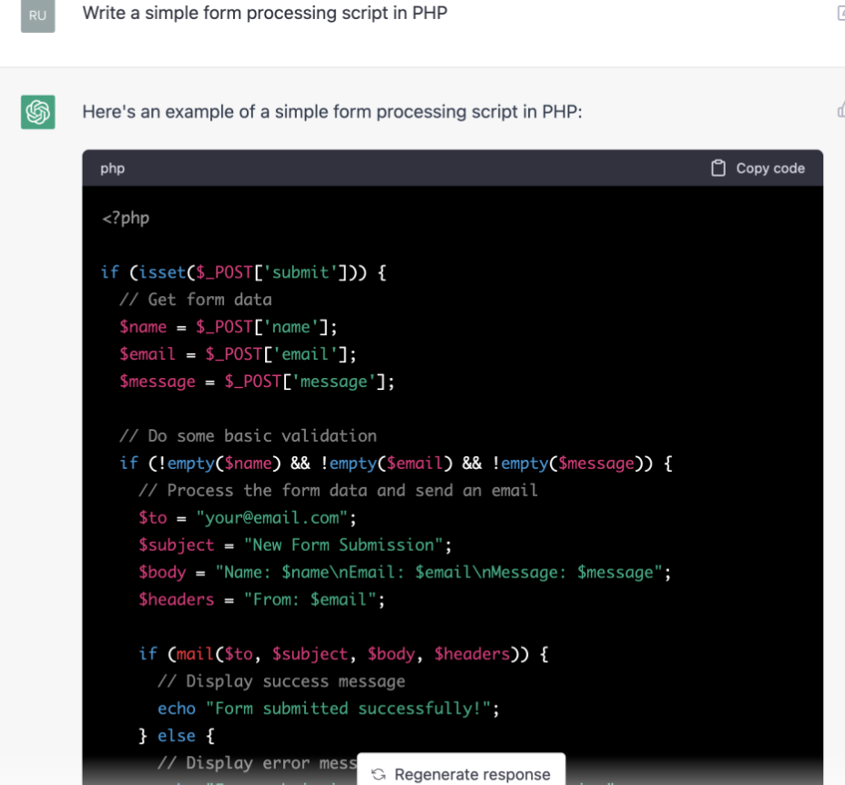
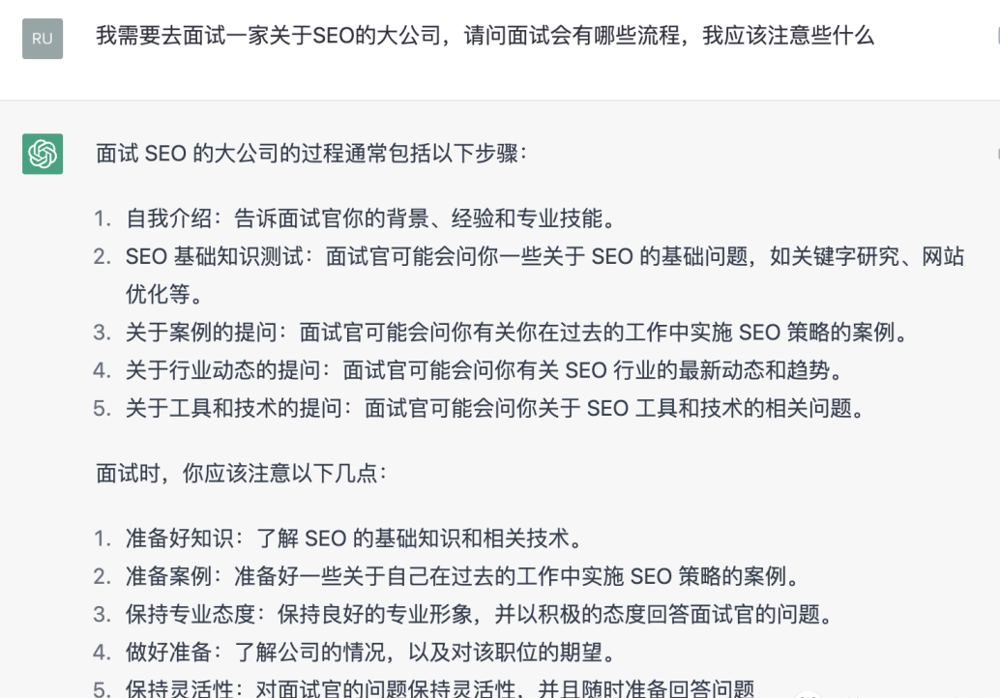
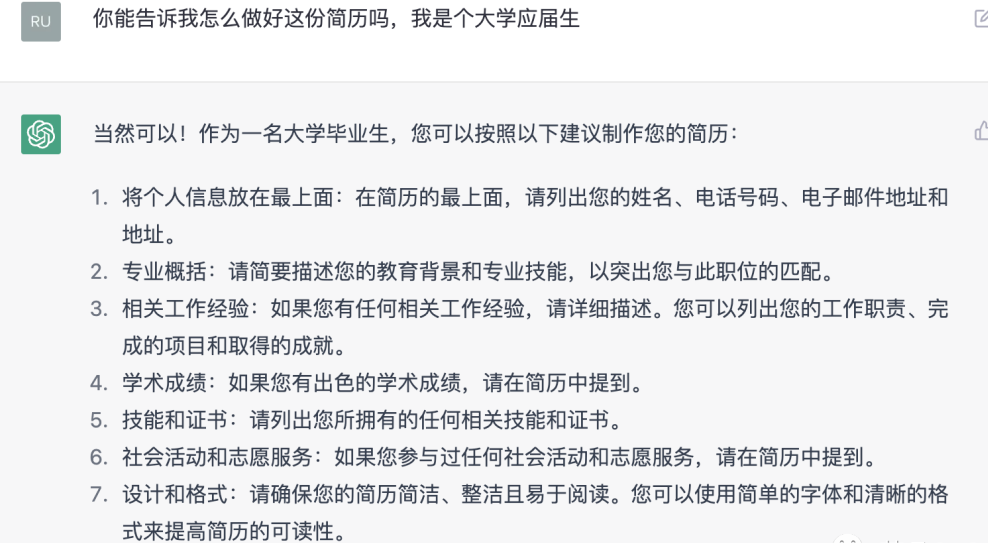
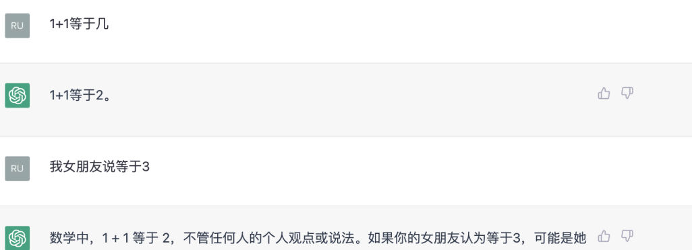
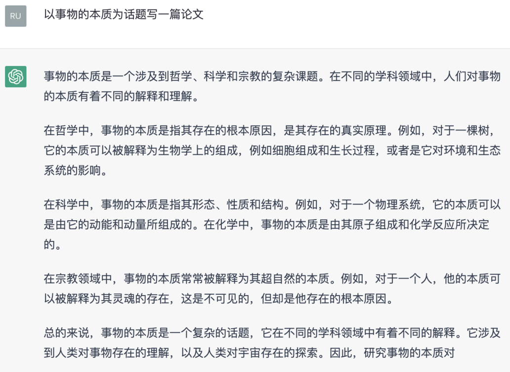
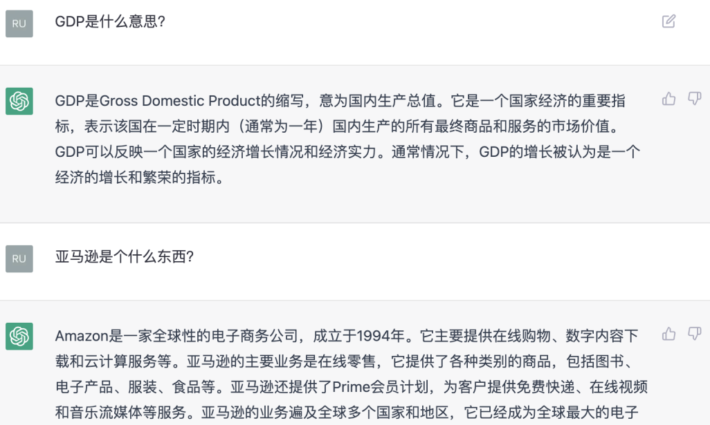
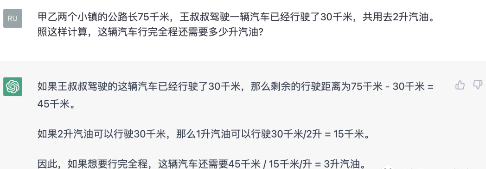

# ChatGPT的有趣用法

### **1. 写 Twitter 帖子**

吉姆·麦克莱德（Jim MacLeod）要求 ChatGPT 为他创建一个关于设计主题的 Twitter 帖子。

### **2. 写小说**

朱塞佩·弗拉托尼（Giuseppe Fratoni）想写一部小说。

“哇，这东西太不可思议了！我惊讶到说不出话。我结合了自己的三个爱好：写作、推理小说和爵士乐，让 ChatGPT 写一部小说。”

他的要求是：“为一部悬疑小说构思一个情节，讲述一个幻想破灭的凶杀案侦探追捕一个聪明的连环杀手的故事，这个杀手以演奏爵士乐标准曲目《秋叶》的乐手为猎物。”

这是他得到的内容：

詹姆斯·汤普森（James Thompson）警探是凶案组一位经验丰富的老手，但最近他感到焦头烂额、心灰意冷。他最近的案子是一名年轻的爵士钢琴家在家中被残忍杀害……

### **3. 演讲嘉宾问答提示**

理查德·布利斯（Richard Bliss）建议：

如果你有一个演讲嘉宾来参加活动，而你需要提问，则可以让 ChatGPT 预先为你生成一些问题。主持人可以说：“这是我们的人工智能要问的问题。”

例如，会议是关于美国西部缺水问题的，演讲者是水资源管理方面的专家。以下是我对人工智能的询问：我应该向海水淡化及其影响方面的专家提出哪些问题？

ChatGPT 回复说：

- 海水淡化目前在世界各地是如何使用的，在哪些类型的地方最有效？
- 使用海水淡化来提供淡水的潜在优点和缺点是什么？
- 海水淡化技术的一些主要挑战和限制是什么？这些问题是如何解决的？

### **4. 创建游戏**

理查德也是著名的棋牌游戏专家，他认为 ChatGPT 可以用于策划和设计新游戏。

### **5. 约会帮助**

坦亚·汤普森（Tanya Thompson）认为这对约会有帮助。ChatGPT 表示，如果你想在约会软件上的第一条信息中加入一点调情的成分，这里有一些建议可以帮助你开始：

- 你从屏幕那头吸引了我的目光，让我忍不住打了个招呼，看看我们之间是否能够擦出火花。
- 你的头像太美了，我无法停止思考你的一切，我多么想更好地了解你。
- 我通常不是一个会主动出击的人，但我不得不给你发这个信息。你是一个非常有吸引力的人，我迫不及待地想和你聊天。”
- 你好，我看了你的资料，不瞒你说，我有点被吓到了。你是如此[有吸引力的品质]，我觉得自己有点像在追星。（还有很多例子可以提供）。

### **5. 应对孤独和焦虑**

我们都发现，ChatGPT 在一对一的对话中表现出色。

PepperBrooks 说：“我现在真的很伤心，很孤独。”

ChatGPT：我很遗憾听到你感到悲伤和孤独。有时感到沮丧是很自然的，但重要的是要记住，你并不孤单。有很多人关心你，想要帮助你。和他人谈谈你的感受会很有帮助，无论是亲密的朋友、家庭成员还是心理健康专家。

有时候，向别人表达你的想法和情绪有助于减轻你的悲伤和孤独。照顾好自己，做一些让自己开心的事情也很重要，比如花时间和你爱的人在一起，追求一个爱好，或者锻炼。这些事情可以帮助改善情绪，让你感觉与他人的联系更紧密。记住，你是强大的，有能力的，你能度过这段艰难的时光。

丹尼尔·内斯特说（Daniel Nestle）说：我认为 ChatGPT 可以用于治疗，所以我要求它生成日记提示，帮助自己处理焦虑问题：

- 1. 写下此刻让你焦虑的事情。
- 2. 描述一个你感到焦虑的情况，以及你是如何应对的。
- 3. 反思你的想法和信念是如何导致焦虑的。
- 4. 给你的焦虑写封信，表达你的感受和担忧
- 5. 想象自己身处一个平静祥和的地方，并详细描述它。

### **6. 命名事物**

丹尼尔继续说：“我想到的另一种用途是事物命名。”

我：帮我想一个新饮料的名字，它有日本杜松子酒、无糖奎宁水、青柠、花椒和葡萄柚。

ChatGPT：“樱花日出”怎么样？这个名字融合了日本杜松子酒以及葡萄柚和青柠的味道，而“日出”这个词暗示着新鲜和充满活力的一天的开始。或者，你也可以选择“花椒葡萄柚杜松子汽水”来强调花椒和柚子的独特味道组合。

### **7. 随身翻译**

丽莎·蒙克斯（Lisa Monks）建议：你可以在手机上使用 ChatGPT ，所以它是一个完美的翻译工具。例如，你在意大利旅行，如果需要帮助：

我：将以下内容翻译成意大利语，“我的车快没油了，你能告诉我最近的加油站在哪里吗？”

ChatGPT ：“La mia auto sta per esaurire il carburante, mi puoi dire dove si trova la stazione di servizio più vicina？”

### **8. 健身**

丽莎·蒙克斯补充道：

我：我希望能在3个月内跑完5公里，为我制定一个能够实现这一目标的运行计划。

ChatGPT ：这里有一个跑步计划，可以帮助你在3个月内跑5公里：

首先，每天步行15-20分钟，以建立自己的耐力，并让你的身体习惯于有规律的锻炼。

在步行一周后，开始将短距离慢跑纳入你的日常生活。开始时，每次慢跑1-2分钟，中间步行休息一下。逐渐增加慢跑的长度，减少步行的时间。

一旦你可以不间断地慢跑10分钟后，就开始增加跑步的距离。目标是不间断跑1公里，然后随着时间的推移逐渐增加距离。

除了定期的跑步之外，还可以将力量训练和拉伸纳入你的日常训练中，以提高你的整体健康水平，降低受伤的风险……

### **9. 编程和集成**

### **10. 教师教案**

斯宾塞·克兰德尔（Spencer Crandall）有一个节省时间的好主意。

今天早上我在想谁的工作是世界上最难的？是老师。学生太多，时间又不够。如果他们能把备课的东西交给 ChatGPT 呢？我试了一下，这就是 ChatGPT 所提供的东西。

**课程名称**：人工智能的历史和影响

**目标**：学生将了解人工智能的历史和发展，并将能够识别和讨论人工智能对社会潜在的积极和消极影响。

**材料：**

- 人工智能历史上重大事件的时间轴
- 人工智能技术和应用实例

**课程大纲：**

- 1. 介绍人工智能的主题，并解释它是指能够模拟人类智力和行为的计算机系统和算法。
- 2. 展示人工智能历史上重大事件的时间轴，并讨论该领域的关键里程碑和发展。
- 3. 展示人工智能技术和应用实例，并解释它们是如何在各个行业和领域中使用的。
- 4. 讨论人工智能对社会的潜在积极和消极影响，包括其提高生产力、效率和安全性的潜力，以及其创造新挑战和担忧的可能性，如工作取代和道德问题……

### **11. 寻找播客嘉宾**

尤里·比拉斯特（Joeri Billast）对此做出了贡献：

我：谁是我Web3营销播客的理想嘉宾？

ChatGPT ：Web3 营销播客的理想嘉宾可能包括行业专家、有影响力的人以及 Web3 营销领域的思想领袖。这些人可能包括活跃在 Web3 营销领域的数字营销人员、内容创造者、创业者、企业家和技术人员。你也可以邀请 Web3 相关的初创公司和组织的代表成为你播客的嘉宾。

我：你能举个例子吗？

ChatGPT ：Web3 营销播客的理想例子可以包括：

- 蒂姆·伯纳-李（Tim Berner-Lee），万维网的发明者
- 克里斯·迪克森（Chris Dixon），安德森·霍洛维茨（Andreessen Horowitz）的普通合伙人
- 维塔利克·布特林（Vitalik Buterin），以太坊创始人
- 乔·鲁宾（Joe Lubin），ConsenSys 创始人
- 苏珊·福勒（Susan Fowler），《告密者》（Whistleblower）作者
- （还有许多其他建议）

### **12. 处理社交媒体平台的评论和意见**

丽莎·蒙克认为 ChatGPT 可以帮助不堪重负的零售人员应对社交媒体问题。

她要求 ChatGPT “对这条餐厅评论做出回应：”

**顾客好评**：我非常喜欢这家店。我们经常在外面吃饭，但是这个地方是最棒的。完美的饭菜，优秀的工作人员，这一切都很棒！特别感谢 Sophie B（你太棒了）。来自黄金海岸的客人们，谢谢。

**ChatGPT 回复：**非常感谢您的赞誉，也感谢您花时间写这篇评论。听到您在我们餐厅有这么好的体验，我们很高兴。我们很高兴您喜欢这次用餐和 Sophie B 提供的服务，很高兴为来自黄金海岸的客人提供服务，我们非常感谢您的支持。我们期待着您的再次光临。再次感谢您的积极评价。

**顾客差评：**食物很一般，风景不错，但也就这样了。

**ChatGPT 回复**：谢谢您的评论。如果您的用餐体验没有达到您的期望，我们深表歉意。我们努力为所有的顾客提供最优质的食物和服务，我们会考虑您的反馈，继续改进。

### **13. 打击犯罪**

扎克·塞珀特（Zack Seipert）说：“我研究了一些著名的悬案， ChatGPT 在罗列犯罪、嫌疑人、线索等方面做得非常出色。我敢打赌，如果 ChatGPT 与经验丰富的侦探团队合作，这些冷门案件中的一些是可以被解决的。”

### **14. 减少偏见**

作家乔安妮·泰勒（Joanne Taylor）知道，在她的作品中区分隐含的偏见是多么困难。在这篇文章中，她请 ChatGPT 帮忙出主意。

具体来说，我让 ChatGPT 检查我输入的文本是否存在种族偏见，它似乎做得很好。

### **15. 家具设计**

来自斯宾塞·克兰德尔（Spencer Crandall）：我使用 ChatGPT 和MidJourney 一起设计了一张独特的小桌子。在 ChatGPT 创造出想法后，我对其进行了编辑，使其清晰简洁，并将其输入到 MidJourney 中。

以下是 MidJourney 输出的结果：

### **16. 创作一部连载小说**

斯科特·斯考夫特（Scott Scowcoft）带领 ChatGPT 对一个故事文本进行了迭代，从而形成了一个连载小说的各个框架。

### **17. 为访谈做准备**

我被邀请参加一个关于“销售的未来”的播客。虽然这与市场营销密切相关，但这有点超出了我的本职工作。因此，我请 ChatGPT 帮我思考一场关于销售未来的访谈。它回答说：

当然，这里有一些你在采访中可能会被问到的关于销售行业未来的问题，以及如何回答这些问题的建议：

1. 你认为技术在未来几年将如何影响销售行业？

在未来几年，技术可能会对销售行业产生重大影响。未来技术可能影响销售行业的一些方式包括，越来越多地使用自动化和人工智能来处理日常任务，以及在数据分析和客户关系管理工具方面越来越多地依赖新技术。此外，电子商务和在线销售渠道的兴起可能会继续重塑销售格局。

2. 你认为销售人员的角色在未来会发生怎样的变化？

在未来，销售人员的角色很可能会随着客户需求和期望的变化而变化。销售人员将需要在现有基础上有更多的知识和咨询能力，并需要能够帮助客户驾驭复杂的产品和服务。此外，数据分析和客户关系管理工具的重要性日益增加，这可能要求销售人员对技术有更深刻的理解，并能够在工作中有效地使用它。

3. 你认为对未来的销售人员来说，最重要的技能是什么？

在未来，销售专业人士将需要各种各样的技能才能取得成功。除了良好的沟通和人际交往能力外，销售人员还需要对产品和服务有很深的了解，并能够有效地使用数据分析和客户关系管理工具。此外，适应不断变化的客户需求的能力，以及不断学习和了解最新行业趋势的能力，对销售职业的成功至关重要。

### **18. 礼品创意**

我不知道该给妻子买什么圣诞礼物。我问：

为一个喜欢老鹰乐队（The Eagles）的中年妇女推荐一个 200 美元以下的礼物。

ChatGPT：对于喜欢老鹰乐队的中年女性来说，一个可能的礼物是一张老鹰乐队经典专辑的黑胶唱片，比如“Hotel California”或者“The Long Run”。近年来，黑胶唱片再次流行起来，许多乐迷都喜欢用黑胶听音乐的独特声音和体验。

你也可以考虑把黑胶唱片和高质量的唱机搭配在一起，这样就可以得到一个完整的大礼包。这种类型的礼物可能会受到老鹰乐队粉丝的欢迎，黑胶唱片和唱机的组合可能在你 200 美元的预算之内。

### **19. 解释复杂的概念**

我：把量子物理解释给我听，就像我是个 10 岁的孩子一样。

ChatGPT：量子物理学是研究微小粒子（如原子和亚原子粒子）的科学分支。这些粒子非常之小，我们每天都能看到、触摸到的东西所遵循的规则，对这些粒子来说并不适用。

例如，有时它们可以同时出现在两个地方。这听起来可能很奇怪，但这就是科学家们从研究这些微小粒子中了解到的。量子物理学帮助我们在很小的范围内理解世界是如何运作的，它还可以帮助我们制造新技术，比如比我们现在拥有的计算机快得多的计算机。

### **20. 形成 AP 风格**

大多数博客、期刊和书籍都遵循美联社风格指南（AP风格指南）。我让 ChatGPT “使用美联社风格指南编辑以下文本”，它做得很完美。

而且，我还让 ChatGPT“为一篇博客文章起一个强有力的标题，介绍 ChatGPT 的 20 种创新和有趣的用法”

### **21、生成页面标题、描述**

一个做led display的页面，现在我想使用Chat GPT生成对应的页面标题和描述。

“要求使用“led display”写出3个单独的标题，要求在70个字符之内，普通的语气，文案吸引用户

按要求写出吸引用户的3段独立的描述，要求160个字符之内，包含关键词”

### **22、改写网站重复内容**

我们在使用工具检查出我们的文章或者页面有一部分重复的段落时，可以使用改写功能。

生成文本内容的不同版本以避免内容重复问题：用3种不同方式改写以下段落，要求不重复并且保留原意

### **23、拓展文章话题**

比如你没有文章话题可写的时候，你可以使用一段话，或者使用几个关键词，然后让他生成用户喜欢的话题

根据以下内容生成10个常见问题

### 24、做数学题

再也不用担心教孩子辅导作业了

### **25、生成代码**

用PHP写一个简单的表单处理脚本，程序员再也不需要百度找代码了，直接抄Chat GPT的它不香吗

### **26、撰写求职信、学习面试技巧**

年初大量的人才求职，如果你不知道简历该怎么做，不知道面试需要注意的地方，不知道如何发挥自己的优势。

不妨与它对对话，它能够让你清晰的做个自我认知。下面我就不一一展示图片了，我把观点列出来，有需要的小伙伴自行对话。

### **27、逗男/女朋友开心**

你对象是不是经常晚上睡不着，吵吵着让你讲笑话，有了Chat GPT，让你瞬间变成幽默大师。除此之外，你还可以使用Chat GPT跟女朋友讲道理，讲到山崩地裂的那种。

### **28、写论文/写歌词/写文章/做视频文案**

### **29、解释事情的定义**

### **30、查找家庭作业和作业问题的答案**

这是一道小学四年级奥数题，你会做吗？

