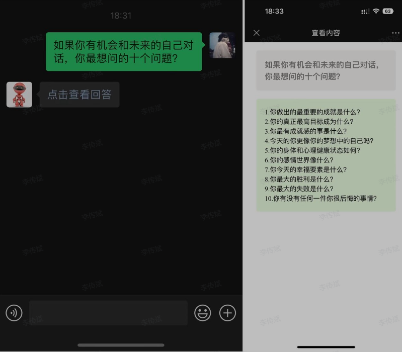

# 如何承接倒卖、使用"GPT账号"所带起来的流量？

## ChatGPT搭建系统平台

低门槛搭建多个平台对话GPT模型系统，拥有自己的机器人通道，"无需梯子”即可使用独立通信线路，带分销体系。
系统支持
公众号、网站
考虑到各个平台封禁力度，暂时开发这两个较为稳定，陆续还会有更新内容。
公众号案例：

网站案例

需求来源
1.注册难，需稳定的“梯子”同时，还需要稳定接码的外网手机号。
2.使用难，无人指导，只觉得GPT跟搜索引擎一样。
3.付款难，免费版经常不回答、连接不稳定，付费版又需要国外支付方式，一个月20美金，自用大多也不划算。
4.推广难，各平台越来越把控规则，再加上账号供应商恶性竞争，账号售价可以低于注册成本（原因：官网使用额度跟api使用额度是分开的），只有账号分销这一个变现渠道，瓶颈性太强。
5.执行难，相信有很多人看到这些“风向标”都有共鸣思路，苦于技术门槛、精力有限、资金有限、不懂怎么做才是高效率等等，止于想法。
6.
主要受众群体
1.无“梯子”的意向者，想方便使用。
2.倒卖GPT账号人群，想拓展业务。
3.已经在接触相关领域的能人，想链接更多资源，把盘做大做完善。
4.

举几个使用群体实际例子
1.普通人使用：
更多会当一个高级搜索引擎来用，它能够帮忙过滤掉许多“干扰信息”，快速总结出符合你要求的答案，无论是简单问题还是复杂问题，只要给出合适的指引，它就能给出最接近你要求的答案。而且这套“规则”，以后可以重复使用，效率是显著的。

2，工作人使用：通常情况下，这类人在工作方向上非常明确，但在很多方面仍需要纯粹的劳动力来铺垫基础工作。在这种情况下，可以借助GPT等人工智能工具来完成这些低级、重复性的任务，然后由人员进行审查和建议，进行优化，这样可以大幅提高工作效率。

3.搞钱人使用：使用GPT等人工智能工具，可以带来很多机会和想象空间。但需要理性地选择适合自己的相关领域，逐步涉及并抓住机会。把握住的才叫机会，不然啥也不是。

二、推广目标
紧跟风口，利益是配套的。（异常值：GPT账号都有成倍利润，是很离谱的）
项目推广可行性
GPT账号、搭建系统分销，已跑通公众号（不要太直接，可以交流群过渡）、小红书（搜关键字大量钩子案例，最好是“已使用”的人设，减少违规风险）、抖音（同小红书，粉丝群过渡小号引流）、b站（同小红书，评论区可以留联系方式）等等，这四个是我测完觉得效果比较好的。
变现案例@某圈友：

推广案例
热度在，投入回报反差大，矩阵化效果更不得了。（搞GPT账号的全是搭建系统的精准客户）
案例1.公众号（推文、微信、企业微信群）

抖音：

b站

百度：

快手：

## 私域提高转化效率补充

1.固定话术，一句话介绍清楚什么是gpt？能干嘛？
2.你能提供的服务内容？尽量简洁明了。
3.能应对90%以上gpt意向人群的常见问题。
4，大方赠送保姆级注册教程、使用教程等等，会自己搞明白的人，不是我们的目标客户，不会的会因此提高信任度。
5.

## 三综上所述

ChatGPT这种风口红利，入局者皆大赚，有能力延伸，那将是取之不尽用之不竭的“宝藏”，欢迎交流、诚心合作。