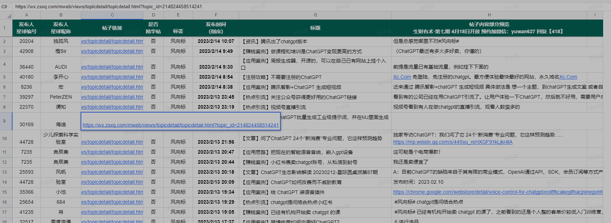

# ChatGPT一些应用案例总结

## 生财整理的内容

### 1.生财有术|ChatGPT相关内容【持续更新】

[https://shengcaiyoushu01.feishu.cn/sheets/shtcnG6woIJ5EhYSq0Tv6FChTUg](https://shengcaiyoushu01.feishu.cn/sheets/shtcnG6woIJ5EhYSq0Tv6FChTUg)

### 2.青峰发现的变现方法

**1、账号出售**

这个变现方法，青峰在上一篇的文章中，已经讲过了，就是自己注册了账号，然后找客户卖出账号。

客户需要的少的话，就自己注册就够用了；如果是渠道强大，一天出个几千个账号的话，那就使用注册机做账号，一天能够跑上万的账号出来。

不会注册，也不会使用注册机的话，那就做中间商，赚差价就行了，一个账号赚个5块钱，一天出个上百账号，或者是上千账号，收益也是不错的。

有人就是通过直播，通过短视频，专门做中间商，做这个账号项目。

**2、试用赚钱**

也就是把ChatGPT，接入企业微信，接入公众号，接入网站等等。

卖使用次数赚钱。

有太多的人，对这个感兴趣了，有太多的职业人员对这个感兴趣了，有太多的公司对这个感兴趣了。

让这些人知道你有这个项目，项目自然就会慢慢展开了。

**3、开培训班**

有卖水的，自然也是有卖铲子的人。

人在哪里，钱就在哪里。

现在，人们对ChatGPT感兴趣，自然是有人想通过这个热点，来赚钱。

有些人是不会做的，有些人还是小白，这时候，有人就把赚钱的方法，一个一个的列出来，整理成教程，卖给那些想通过ChatGPT赚钱的人。

就像是把ChatGPT的所有变现方法列出来，然后，教给学习的人，让他们选择合适的方式，进行变现。

仅仅是青峰知道的，就有10个人在开设这方面的课程，当然，青峰不知道地培训，也会更多一些。

课程有的是99块钱，有的是199块，还有的299块钱，目前，青峰见过的最贵的这类课程，也就是988块钱。

**4、开发者**

简单来说，有些人想把ChatGPT接入为企业微信里面，有些人想接入到飞书里面，有些人想接入到公众号里面，有些人想接入到钉钉里面。

但是，自己不懂这方面技术的话，就可以找开发者来解决了，对于会的人来说，其实不难，而且网站上面也有教程，稍微研究一下，就可以做这块的业务了。

**5、做网站**

有人使用ChatGPT大量生成内容，一天生成上万篇，甚至更多的内容，然后把这些内容导入到网站里面。

有些人做的收录SEO排名，在短短时间之内，通过大量的内容，就获得了大量的排名和流量，直接做项目变现，卖产品的卖产品，卖服务的卖服务了。

**6、百度问答**

也就是百度问一问，刚开始做百度问一问的时候，大家一般是使用搜索引擎，看到问一问的问题，然后，再到搜索引擎里面，搜索相关的问题找答案。

现在有了ChatGPT，直接对找问题问他就行了，省去了搜索引擎的广告，省去了排版的时间，省去了筛选的时间。

关键是通过率是非常高的，一般有个95%的通过率。

有个这个ChatGPT，多个账号操作，一点也没有问题了，只要是问题足够的话吗，一天赚个大几百，一点问题都没有。

项目很简单，想做的话，直接搜索百度问一问，然后就能够做这个项目了。

**7、生成短视频**

有个朋友说，有了ChatGPT，制作短视频，简直就是母猪产仔。

其实，真要是说起来，把这可比母猪产仔快的多了。

使用ChatGPT直接生产想要的文章，直接使用剪映就能够做成原创短视频了，直接是5分钟就做成了。

如果想操作某个领域的短视频霸屏的话，直接大量的出产内容，一天做个100多个，甚至几百个短视频，就行了，到时候，整个平台上面，某个领域都是你的短视频。

这是不是相当于这个领域的流量，都会走到你这里。

去你那有人做公众号霸屏，就是大量的发内容，专门做上千块或者是几千块的产品，一天发出去几千篇，上万篇内容，直接把某个领域的流量一网打进了，一天出个三五十单，就是三五万，甚至十几万的收益。

现在，短视频也是能够霸屏的，有些人正在寻找合适的领域进行操作，这既是红利时间了，就看谁能够快速变现了。

**8、配合数字人**

现在的数字人真是厉害，在短视频里面跟真人，也看不出差别来。

有些数字人还能够学习，你看到某个直播里面的人，感觉很不错，可以让数字人跟她学习，慢慢的数字人就有了这个人的面容，有了这个人的说话语气。

再ChatGPT生产的原创内容，就能够做出更好的短视频了。

如果真人的文案稍微弱一下，就被数字人+ChatGPT做成的短视频，给超越了。

**9、写文章**

这个文章有很多种类，青峰在这里列一下，这都是这段时间，测试出来的，有些是青峰测试出来的，有些人其他领域的人测试出来的。

特点就是问的越详细，得到内容就会越好。

写商业文案

写热点文案

写小红书文案，不少做小红书的人，写的文案真不如ChatGPT写的好。

写自媒体文章

写跨境电商文案

写小说

写朋友圈文案，你看到某个朋友圈文案，可能就是ChatGPT写的。

写诗

**10、生成图片**

能够生成原创logo，有些logo感觉很惊艳。

能够生产壁纸

搭配ai绘画

**11、做直播**

有人使用数字人和ChatGPT，可以做直播，甚至还能够跟人进行互动，想来，直播行业的压力也会是挺大的，ChatGPT也能够让一些人改变直播的行业了。

数字人再继续发展下去，ChatGPT再继续成长，以后直播的时候，看到的人真不知道是什么了。

**12、写代码**

没看错，就是写代码，这也没有什么解释的了。

写代码，审查代码。

**13、讲故事**

ChatGPT能够讲中文故事，也能够讲英文故事，有个报道是这么说的，通过ChatGPT的交流，听ChatGPT讲故事，孩子的英语成绩都提升了。

看来，ChatGPT的故事讲的是不错的。

有做教育的人，已经在ChatGPT上，跟他交流，通过产生的故事文案，再加上自己上镜，开始做自媒体，开始做短视频了。

**有了ChatGPT，就算是从零开始做一个自媒体，都是能够实现的。**

比如：

①先告诉他，你想做一个什么领域的自媒体账号；

他会告诉你，从哪些角度，去做内容比较好；

②这时候，选择一个角度，让他给出知识点；

他就会告诉你，好几个知识点；

③选一个知识点，让他以这个知识点为主题，写一条文案，再配上合适的例子。

这样的话，一篇文章就生成了。

下一次，在问知识点，在生产文章，不断地做下去，一个自媒体账号就从零开始，慢慢的做起来了。

如果感觉一个账号起来的速度慢了，那就一次性多做一个账号，也只是多问几次的事情罢了。

一次做10个账号，就算是起来5个账号，一个账号一个月赚个5万块，5个账号一个月就是5万块的收入了。

14、搭建智能聊天机器人

这个也没有什么可说的，一看就了解了，就是智能聊天机器人。

15、做音频赚钱

ChatGPT的文字生成能力，故事生成能力，有人就用ChatGPT生成了大量的内容。

再加上配音神器，直接生成音频，然后上传到喜马拉雅等平台，去变现赚钱。

一些人在讲论语，一些人在讲易经，有些人再讲孙子兵法，这些只有声音的音频，有可能就是ChatGPT生成的。

另外，ChatGPT还能够给人取名，还能够写情书，昨天，ChatGPT写的情书，可是比很多人写的都要强了

### 3.哥飞大佬总结的ChatGPT 变现方法

1、卖账号；
2、部署一个公众号，用户免费使用N次，分享海报，带来新关注，每个关注送N次；
3、部署一个小程序，用户免费使用N次，关注公众号可以送N次，每看一次激励视频可以送1次；
4、帮助其他人部署公众号或者小程序，每个收费1000元；
5、做一个垂直需求的产品，基于ChatGPT提供的能力，输出内容，卖内容或者卖服务，如《仅2年时间，Copy.ai的ARR达1000万美金用户突破200万》[mp.weixin.qq.com](http://mp.weixin.qq.com/)；
6、帮助他人做5这种垂直需求产品，每个产品收费1000元；
7、做一个内容站点，收集热门搜索词，用ChatGPT 提供的内容给搜索引擎收录，赚广告费；
8、帮助别人建立7这种站点。每个站点收费1000元；欢迎加我微信qiayue交流。
9、招代理，让别人帮你宣传，以上所有1000元的服务，定价2999，但你只收600元，中间的差价由代理赚，代理就会很卖力的帮你宣传；
10、把以上方法发到微信公众号的付费文章里，定价888微信豆；
11、帮别人把 ChatGPT 机器人接入到他的微信群里，收费1000元；
12、开发一套兔注册免登录国内打开速度快的反向代理站点，开源到GitHub；
13、用12的代码部署一个兔注册免登录国内打开速度快的反向代理站点，提供给用户免费使用，底部加一个链接到GitHub仓库；
14、当13站点的用户足够多时，12的仓库Star也会足够多，你就可以提供收费部署反代站点服务，总有些不懂代码或者不愿意麻烦的老板愿意花钱的。
15、我们用网页版问了很多问题，得到很多回答，但是一刷新就没了，所以急需开发一个服务，如浏览器插件，能够自动保存问题和回答，还需要有问题列表页面管理所有问题和回答。插件收费方式可以是免费保存所有问题和回答，但是只能免费查看最新保存的5条问答，想要看所有问答就需要开通VIP会员。

### 3 仅2年时间，Copy.ai的ARR达1000万美金用户突破200万

### https://mp.weixin.qq.com/s/12zizCQftueNe/VtpvOk-A

### 4. 如何用ChatGPT赚钱

1写商品推荐，赚推广费。（英文站）
2.写广告文章，为自己的产品宣传。（英文站）
3.回答别人的付费问题。
4.写电子书，买书赚钱。
5.写视频脚本，不出镜，靠剪辑画面发视频赚钱。
6.写代码接活赚钱。（英文）
7.写文章接活赚钱。（各国语言）
8.翻译文章赚钱。

**成立一家AIGC公司，然后搞钱**
[https://mp.weixin.qq.com/s/vyC1K5vPNDd66YY7uG8jRA](https://mp.weixin.qq.com/s/vyC1K5vPNDd66YY7uG8jRA)

### 5 AIGC开源项目库（可以为你提供思路，去制作小程序）

### 变现1.利用ChatGPT写网文，还能帮同行代写赚钱
### 6 私教+伴读书僮

这个用法很有意思，一个朋友将chatGPT改造成了一个"私教+伴读书僮"，在学习的前、中、后环节分别与chatGPT进行互动-在学习前给出预习的提示，在学习中完成充分的讨论，加深理解，在学习后出题完成quiz，并且给出实操的建议。我自己试了一下，效果虽然不是非常理想，但潜力很大。如果能够把教育的一些框架和方法论融合进去，再加上一些个性化的设置，想必能够极大地提升学习效率。
最近看到的一些AIGC的比较实用的用法。

用法1：用作“私-即刻App即刻App，享受探索、表达和创造
变现路径：定制化服务或者做成训练好的小程序去推广，在教培领域还是不错的或者去小红书发布案例，卖搭配的资料

### 7.用作半自动绘本视频生成器

《人类还剩几集可以逃？》
www.bilibili.com

这是一个B站Up主做的一个视频，并没有用到什么新奇的玩法，依旧是ChatGPT+Midjourney+Clipchamp这些"常规"的工具，但视频做得很实用，手把手带着你从零开始，完全不用发挥任何创造性，就完成了一个效果及格的绘本视频，从剧本、图片、配音、音乐，一条龙服务。想必这未来会变成全自动的流程，也将成为创作的常态，人类作为甲方，负责提需求和挑选成品，而AI作为乙方，负责孜孜不倦地给出候选作品。--来自即友Diiiii变现：卖绘本，发长视频引流等等

### 8.用作长内容（视频/音频/文章）缩略预览助手

主要是针对一些可能耗时比较多的视频、播客、长文章，用chatGPT可以先提取摘要做个预览，用来判断是否值得花时间来继续。
变现：总结文章，做小程序等等

### 9.GPT写文案+Midjourney生成形象+Elevenlabs音频编辑+D-ID生成视频看了一个视频分享。

尝试用GPT写了段文案+用Midjourney生成形象+Elevenlabs做音频编辑+D-ID视频生成了一段业务介绍。用时5分钟，完全免费，成本几乎为0，有手就行。
从事设计营销视频等创意行业的人应该了解，一个数字人的报价成本大概是什么水平…..
而现在AI技术应用的涌现以及联动带来的效应，实际体验下来确实惊人，这样的体验感受不亚于20多年前第一次使用PC拨号上网后的所见所得…接下来世界要热闹了。ChatGPT 这次真的算敲开了新世界的大门！看了一个视-即刻App即刻App，享受探索、表达和创造变现：运营运营运营，不用多说了吧

### 10 直播用ChatGPT答题+引流私域买账号（附方法SOP）

这是目前路径最短的变现方法，可以迅速盈利，大家可以放手去做，趁这个窗口期
包括小红书引流，目前都还可以跑通这个路径（这里推荐一个可复制案例库，所有的实操讲解都不如可复制的SOP）：小红书可复制案例库[https://xiaobot.net/p/xhs?refer=beb64331-a40f-4d03-82e7-f310f66024f7](https://xiaobot.net/p/xhs?refer=beb64331-a40f-4d03-82e7-f310f66024f7)

### 11 结合midjourney生成图片变现

chatGPT提供提示词，结合midjourney生成各种好看的图片发布抖音小红书引流变现（可加盟壁纸程序或者创建公众号引流）或者如下面一样建立一个创意库进行贩卖，大家可以进去学习学习，直接根据提示词生成图片去引流Midjomie创意屋
Midjourney进阶创意库|2023665 读者，9 内容
一个AI绘图武器库，也是一个图片壁纸库，微信扫码查看专栏
另外可以学会这门技术，去生成商用图片，进行贩卖，目前有朋友买到了300一张图，这里推荐一个课程：
详细介绍了如何利用AI绘画，并且有关键词圈，抖音小红书爆火的关键词图